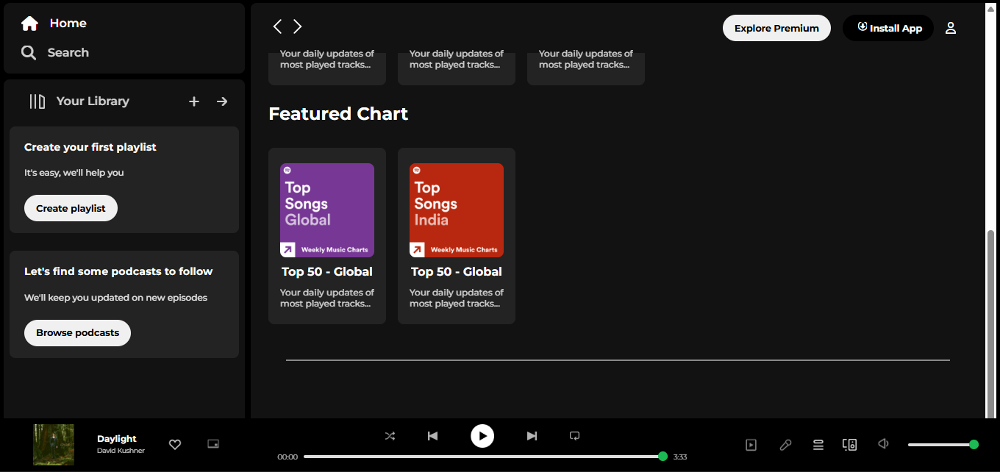

# Spotify Clone

A **Spotify-inspired music player UI** built using only **HTML and CSS**.  
This project replicates the Spotify interface layout and design.

## 🚀 Features
- Responsive layout
- Styled like Spotify
- Hover effects and visual elements

## 🛠 Tech Stack
- HTML5
- CSS3

## 📁 Project Structure
spotify/
│── index.html # Main HTML page
│── spotify.css # CSS styling
│── assets/ # Images (album covers, icons)
│── README.md # Project documentation

---

## 📸 Screenshot
  
*Tip: Take a screenshot of your project and save it in the `assets` folder.*

---

## 💡 Future Improvements
- Add **interactive features** with JavaScript (play/pause, playlists)  
- Improve **mobile responsiveness** and layout  
- Add multiple pages like **Library, Search, and Playlist**  
- Integrate with **Spotify API** for real music data  

---

## 🔗 Live Demo
*(Optional: If you deploy later via GitHub Pages)*  
[View Live on GitHub Pages](https://palak216.github.io/Spotify---Clone/)

---

## 📌 Notes
This project is **HTML and CSS only** — no backend or database.  
Perfect for practicing UI design and layout skills.
